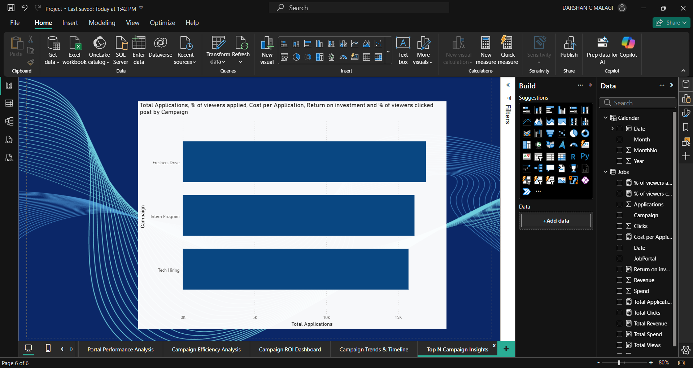

# 📊 Power BI Performance Report

## 📌 Project Overview
This Power BI project analyzes performance metrics across marketing channels, campaign effectiveness, and key trends.

## 🛠 Tools Used
- Power BI Desktop
- Data modeling
- Visual analytics

## Dashboard Previews

### Executive Overview

### Campaign ROI Dashboard

### Campaign Efficiency Analysis

### Campaign Trends & Timeline

### Portal Performance Analysis

### Top N Campaign Insights

## 📈 Key Findings
- Highest performing channel identified
- KPI trends across periods are visible
- Insights based on filters
